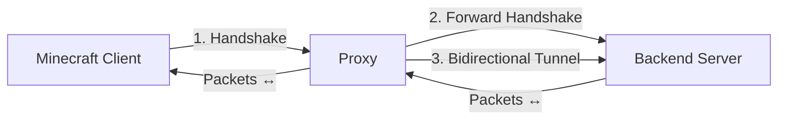
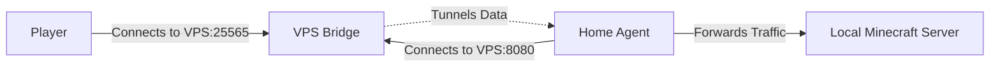

# Architecture

This project implements a lightweight TCP proxy for Minecraft. It works in "Lite Mode", which simply tunnels traffic between the client and the backend server after forwarding the initial handshake packet.

## High-level Flow

## Components

1.  **TCP Listener**: Listens on a configurable port (default `25565`) for incoming Minecraft client connections, using `Bun.listen`.
2.  **Handshake Parser**: Reads and decodes the first packet (Handshake) sent by the client, extracting protocol version, server address, port, and next state.
3.  **Backend Connection**: Establishes a TCP connection to the real Minecraft server (configurable host and port).
4.  **Tunnel**: Once the handshake is forwarded, all subsequent data is piped bidirectionally between client and backend. The tunnel also handles clean shutdown and error propagation.

## Reverse Tunnel Architecture

For the Reverse Tunnel feature (VPS <-> Home), the architecture is slightly different:

1.  **Bridge Server (VPS)**: Listens on a public port for players and a control port for the home agent.
2.  **Home Agent (Home)**: Connects to the VPS Bridge and forwards traffic to the local Minecraft server.
3.  **Data Flow**: When a player connects to the Bridge, the Bridge signals the Agent to open a new data channel. Traffic is then proxied through this channel.
