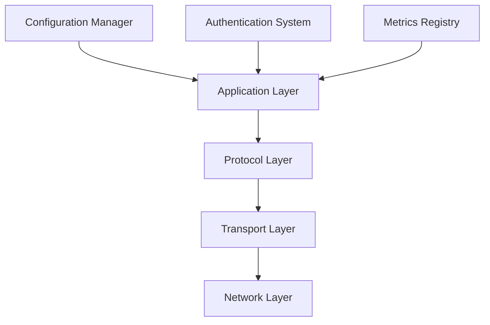
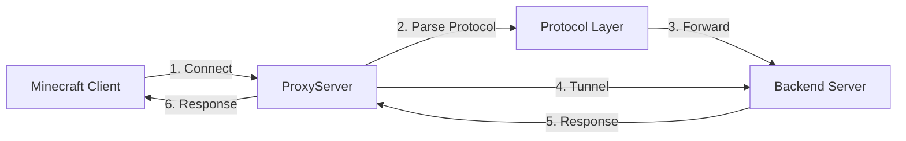
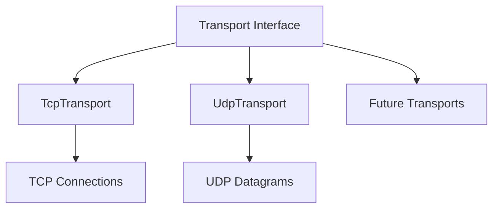
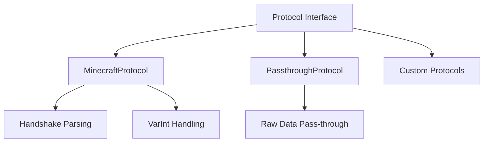
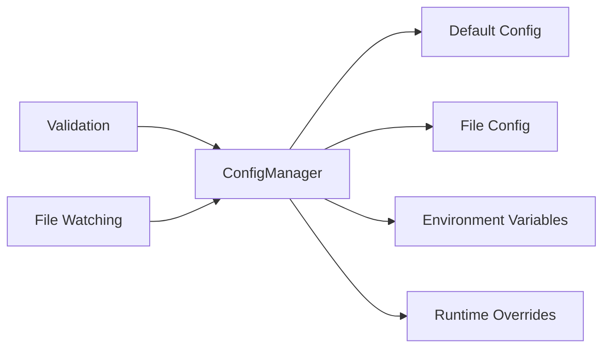
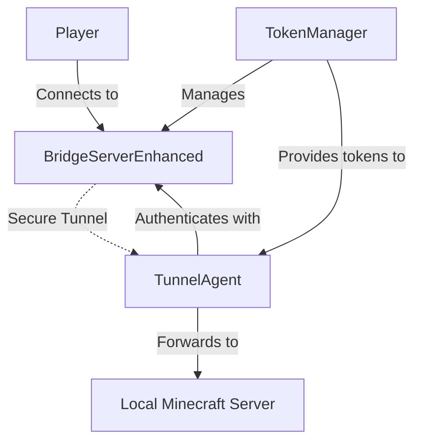
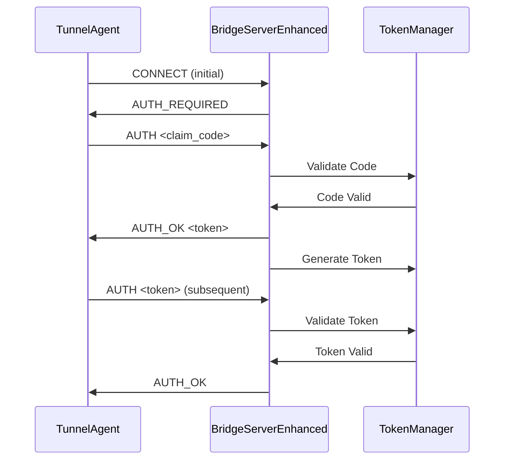
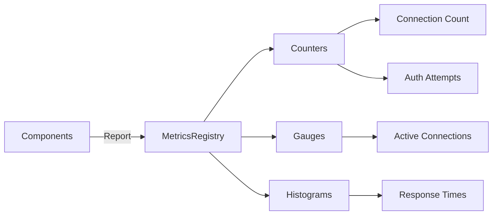

# Architecture

This project implements a lightweight, modular TCP proxy for Minecraft with support for multiple transport types, protocols, and advanced authentication mechanisms.

## High-level Architecture

The project follows a layered architecture with clear separation of concerns:

## Core Components

### 1. Proxy Server (`ProxyServer`)

The main entry point that orchestrates the proxy functionality:

**Features:**
- Multiple transport support (TCP/UDP)
- Pluggable protocol parsers
- Configurable handshake handling
- Connection pooling and management

### 2. Transport Layer

Abstract transport interface with concrete implementations:

**Responsibilities:**
- Network connection management
- Data transmission and reception
- Connection lifecycle events
- Rate limiting and security

### 3. Protocol Layer

Pluggable protocol system for different packet formats:

**Features:**
- Minecraft handshake parsing
- VarInt encoding/decoding
- Extensible for custom protocols
- Packet validation and error handling

### 4. Configuration Management

Advanced configuration system with multiple sources:

**Capabilities:**
- YAML/JSON file support
- Environment-specific overrides
- Runtime configuration updates
- Validation and error handling

## Reverse Tunnel Architecture

Enhanced reverse tunnel with authentication and token management:

### Enhanced Bridge Server Components

1. **BridgeServerEnhanced**: Main bridge with authentication
2. **TokenManager**: Handles token generation and validation
3. **Rate Limiting**: Connection and authentication rate limits
4. **Subdomain Routing**: Multi-tenant support via subdomains

### Authentication Flow

## Security Features

### Authentication System
- **Token-based authentication**: Secure token generation and validation
- **Claim codes**: One-time codes for initial authentication
- **Rate limiting**: Protection against brute force attacks
- **IP-based blocking**: Automatic blocking of suspicious IPs

### Connection Security
- **Timing-safe comparisons**: Protection against timing attacks
- **Connection limits**: Per-IP connection rate limiting
- **Buffer overflow protection**: Maximum buffer size limits
- **Timeout handling**: Connection timeout management

## Metrics and Monitoring

Integrated metrics system for monitoring:

**Available Metrics:**
- Connection counters (total, active, failed)
- Authentication statistics
- Protocol parsing metrics
- Error rates and types

## Scalability Features

### Multi-Bridge Management
- **BridgeManager**: Manages multiple bridge instances
- **Load balancing**: Distribute connections across bridges
- **Health checking**: Monitor bridge health and status
- **Dynamic scaling**: Add/remove bridges as needed

### Namespace Support
- **Multi-tenant**: Support for multiple isolated environments
- **Subdomain routing**: Route based on subdomain patterns
- **Resource isolation**: Separate resources per namespace
- **Configuration per namespace**: Custom settings per environment
