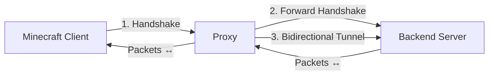

# Minecraft TCP Proxy (Lite Mode)

## Overview

This project implements a lightweight TCP proxy for Minecraft using Bun. It works in "Lite Mode", which simply tunnels traffic between the client and the backend server after forwarding the initial handshake packet. No packet decoding, state tracking, or permission management is performed, resulting in minimal overhead and a simple codebase.

## Architecture

### High-level Flow



### Components

1. **TCP Listener** – Listens on a configurable port (default `25565`) for incoming Minecraft client connections, using `Bun.listen`.
2. **Handshake Parser** – Reads and decodes the first packet (Handshake) sent by the client, extracting protocol version, server address, port, and next state.
3. **Backend Connection** – Establishes a TCP connection to the real Minecraft server (configurable host and port).
4. **Tunnel** – Once the handshake is forwarded, all subsequent data is piped bidirectionally between client and backend. The tunnel also handles clean shutdown and error propagation.

## Implementation Details

### VarInt Utilities (`src/varint.ts`)

VarInt is a variable-length integer encoding used extensively in the Minecraft protocol. The following functions provide synchronous reading/writing from/to a buffer.

```typescript
export function readVarIntSync(buffer: Uint8Array, offset: number): { value: number; offset: number } {
  let result = 0;
  let shift = 0;
  let byte: number;
  do {
    byte = buffer[offset]!;
    offset++;
    result |= (byte & 0x7F) << shift;
    shift += 7;
  } while ((byte & 0x80) !== 0);
  return { value: result, offset };
}

export function writeVarIntSync(buffer: Uint8Array, value: number, offset: number): number {
  do {
    let temp = value & 0x7F;
    value >>>= 7;
    if (value !== 0) {
      temp |= 0x80;
    }
    buffer[offset++] = temp;
  } while (value !== 0);
  return offset;
}

export function varIntLength(value: number): number {
  let length = 0;
  do {
    value >>>= 7;
    length++;
  } while (value !== 0);
  return length;
}
```

### Handshake Parsing (`src/handshake.ts`)

The handshake packet structure is:

- Packet length (VarInt)
- Packet ID (VarInt, must be `0x00`)
- Protocol version (VarInt)
- Server address (string: VarInt length + UTF-8 bytes)
- Server port (unsigned short, big-endian)
- Next state (VarInt)

`parseHandshake` reads a buffer and returns the decoded handshake together with the number of bytes consumed.

```typescript
export interface Handshake {
  packetLength: number;
  packetId: number;
  protocolVersion: number;
  serverAddress: string;
  serverPort: number;
  nextState: number;
}

export function parseHandshake(buffer: Uint8Array): { handshake: Handshake; bytesRead: number } {
  let offset = 0;

  const packetLengthResult = readVarIntSync(buffer, offset);
  const packetLength = packetLengthResult.value;
  offset = packetLengthResult.offset;

  const packetIdResult = readVarIntSync(buffer, offset);
  const packetId = packetIdResult.value;
  offset = packetIdResult.offset;
  if (packetId !== 0x00) {
    throw new Error(`Expected packet ID 0x00 for handshake, got ${packetId}`);
  }

  const protocolVersionResult = readVarIntSync(buffer, offset);
  const protocolVersion = protocolVersionResult.value;
  offset = protocolVersionResult.offset;

  const addressLengthResult = readVarIntSync(buffer, offset);
  const addressLength = addressLengthResult.value;
  offset = addressLengthResult.offset;

  const serverAddress = new TextDecoder().decode(buffer.slice(offset, offset + addressLength));
  offset += addressLength;

  const serverPort = (buffer[offset]! << 8) | buffer[offset + 1]!;
  offset += 2;

  const nextStateResult = readVarIntSync(buffer, offset);
  const nextState = nextStateResult.value;
  offset = nextStateResult.offset;

  // Validate we consumed exactly packetLength + length of packet length VarInt
  const expectedBytes = packetLength + varIntLength(packetLength);
  if (offset !== expectedBytes) {
    throw new Error(`Parsed ${offset} bytes but expected ${expectedBytes} for packet length ${packetLength}`);
  }

  return {
    handshake: { packetLength, packetId, protocolVersion, serverAddress, serverPort, nextState },
    bytesRead: offset,
  };
}
```

### Tunnel Manager (`src/tunnel.ts`)

`createTunnel` sets up event handlers on both sockets to forward data and ensures proper cleanup when either side closes or errors.

```typescript
export function createTunnel(
  client: Socket,
  backend: Socket,
  options: TunnelOptions = {}
): void {
  const { onClose, onError, debug = false } = options;
  const log = debug ? console.log : () => {};

  let clientClosed = false;
  let backendClosed = false;

  const closeTunnel = () => {
    if (clientClosed && backendClosed) return;
    log('Closing tunnel');
    if (!clientClosed && client.readyState === 'open') {
      client.end();
      clientClosed = true;
    }
    if (!backendClosed && backend.readyState === 'open') {
      backend.end();
      backendClosed = true;
    }
    onClose?.();
  };

  client.data = (data: Buffer) => {
    if (backend.readyState === 'open') backend.write(data);
    else closeTunnel();
  };

  backend.data = (data: Buffer) => {
    if (client.readyState === 'open') client.write(data);
    else closeTunnel();
  };

  client.close = () => {
    log('Client disconnected');
    clientClosed = true;
    closeTunnel();
  };

  backend.close = () => {
    log('Backend disconnected');
    backendClosed = true;
    closeTunnel();
  };

  client.error = (error: Error) => {
    log(`Client socket error: ${error}`);
    onError?.(error);
    closeTunnel();
  };

  backend.error = (error: Error) => {
    log(`Backend socket error: ${error}`);
    onError?.(error);
    closeTunnel();
  };

  log('Tunnel established');
}
```

### Connection Handler (`src/connection-handler.ts`)

The `ConnectionHandler` class manages the lifecycle of a client connection: it buffers data until a complete handshake is received, connects to the backend, forwards the handshake (and any leftover data), and finally creates the tunnel.

Key methods:

- `handleConnection(client: Socket)` – entry point for a new client.
- `handleHandshake(...)` – attempts to parse the handshake; on success, establishes backend connection and tunnel.

```typescript
export class ConnectionHandler {
  private config: ProxyConfig;
  private handshakeBuffer = new Uint8Array();
  private handshakeParsed = false;
  private backendSocket: Socket | null = null;

  constructor(config: ProxyConfig) {
    this.config = config;
  }

  handleConnection(client: Socket): void {
    // ...
    client.data = (data: Buffer) => {
      if (!this.handshakeParsed) {
        this.handleHandshake(client, data, cleanup, log);
      }
    };
    // ...
  }

  private handleHandshake(client: Socket, data: Buffer, cleanup: () => void, log: (...args: any[]) => void): void {
    // Append data, try to parse
    // On success:
    Bun.connect({
      hostname: this.config.backendHost,
      port: this.config.backendPort,
      socket: {
        open: (backend) => {
          // Send handshake and leftover data
          // Create tunnel
        },
        // error handling
      },
    });
  }
}
```

### Proxy Server (`src/proxy.ts`)

The main entry point is `startProxy`, which creates the TCP listener and delegates each connection to a `ConnectionHandler`.

```typescript
export async function startProxy(config?: Partial<ProxyConfig>) {
  const fullConfig = createConfig(config);
  const connectionHandler = new ConnectionHandler(fullConfig);

  const server = Bun.listen({
    hostname: '0.0.0.0',
    port: fullConfig.listenPort,
    socket: {
      open: (client) => connectionHandler.handleConnection(client),
      close: (client) => { if (fullConfig.debug) console.log('Socket closed'); },
      error: (client, error) => console.error('Socket error:', error),
    },
  });

  console.log(`Minecraft proxy listening on port ${fullConfig.listenPort}`);
  console.log(`Backend: ${fullConfig.backendHost}:${fullConfig.backendPort}`);
  if (fullConfig.debug) console.log('Debug mode enabled');
  return server;
}
```

If the file is executed directly, it starts the proxy with debug enabled:

```typescript
if (import.meta.main) {
  startProxy({ debug: true }).catch(console.error);
}
```

### Configuration (`src/config.ts`)

Configuration is defined by the `ProxyConfig` interface. Default values are provided and can be overridden via `createConfig`.

```typescript
export interface ProxyConfig {
  listenPort: number;
  backendHost: string;
  backendPort: number;
  debug: boolean;
}

export const defaultConfig: ProxyConfig = {
  listenPort: 25565,
  backendHost: 'localhost',
  backendPort: 25566,
  debug: false,
};

export function createConfig(overrides?: Partial<ProxyConfig>): ProxyConfig {
  return { ...defaultConfig, ...overrides };
}
```

## Running the Proxy

### Prerequisites

- [Bun](https://bun.sh) (version 1.3.3 or later recommended)

### Installation

```bash
bun install
```

### Start the Proxy

```bash
bun start
```

This runs the script defined in `package.json` (`bun run src/proxy.ts`) with default configuration (listen on 25565, backend localhost:25566, debug on).

To customize, you can edit the call in `src/proxy.ts` or pass configuration when calling `startProxy` programmatically.

Example: creating a custom script:

```typescript
import { startProxy } from './src/proxy.js';

startProxy({
  listenPort: 3000,
  backendHost: 'mc.example.com',
  backendPort: 25565,
  debug: true,
});
```

## Testing

The project includes a comprehensive test suite using `bun:test`.

Run all tests:

```bash
bun test
```

The tests cover:

- **VarInt** (`test/varint.test.ts`): reading, writing, length calculation.
- **Handshake parsing** (`test/handshake.test.ts`): valid and invalid packets.
- **Tunnel** (`test/tunnel.test.ts`): data forwarding, error handling, cleanup.
- **Configuration** (`test/config.test.ts`): default values and merging.

All tests should pass before deploying.

## Limitations

- **No packet inspection/modification**: The proxy only forwards bytes; it cannot alter or intercept packets.
- **No authentication**: The proxy itself does not authenticate clients; the backend server must be configured appropriately (online/offline mode).
- **Single backend**: The current implementation only supports one backend server. Load balancing or failover would require additional logic.
- **No support for proxy protocol or virtual host modification**: The handshake is forwarded as-is; advanced features like PROXY protocol or virtual host rewriting are not implemented.

## Future Enhancements

Possible improvements include:

- Support for multiple backends and load balancing.
- Integration of PROXY protocol (v1/v2).
- Optional handshake modification (e.g., rewrite virtual host).
- Connection timeouts and keep-alive.
- Metrics and logging.

## License

This project is open source under the MIT License.

---

*Documentation generated from code and inspired by the architecture description in `specs.md`.*
