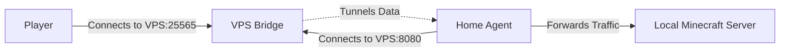

# Reverse Tunneling (VPS <-> Home)

If you want to host a Minecraft server at home (behind a firewall/NAT) but allow players to connect via a public VPS, you can use the **Reverse Tunnel** feature.

## Architecture

1.  **Bridge Server (VPS)**: Listens on a public port (e.g., 25565) for players and a control port (e.g., 8080) for your home agent.
2.  **Home Agent (Home)**: Connects to the VPS Bridge and forwards traffic to your local Minecraft server.



## Setup

### 1. On your VPS (Public Server)

Run the Bridge Server. This will listen for players and for your home agent.

**`vps-bridge.ts`**:
```typescript
import { BridgeServer } from 'minecraft-tcp-proxy';

const bridge = new BridgeServer({
  publicPort: 25565,       // Port for Players
  controlPort: 8080,       // Port for Home Agent
  secret: 'my-secret-key', // Security token
  debug: true,
});

bridge.start();
```

Run it:
```bash
bun run vps-bridge.ts
```

### 2. At Home (Private Server)

Run the Agent. This connects to your VPS and your local Minecraft server.

**`home-agent.ts`**:
```typescript
import { TunnelAgent } from 'minecraft-tcp-proxy';

const agent = new TunnelAgent({
  bridgeHost: '1.2.3.4',   // Your VPS IP
  bridgeControlPort: 8080, // Must match VPS controlPort
  localHost: 'localhost',  // Your Local Minecraft Server IP
  localPort: 25565,        // Your Local Minecraft Server Port
  secret: 'my-secret-key', // Must match VPS secret
  debug: true,
});

agent.start();
```

Run it:
```bash
bun run home-agent.ts
```

## How it works

1.  The **Agent** maintains a persistent control connection to the **Bridge**.
2.  When a **Player** connects to the VPS (Bridge), the Bridge sends a signal to the Agent.
3.  The **Agent** opens a new connection to the Bridge (Data Channel) and a new connection to the Local Minecraft Server.
4.  The **Bridge** links the Player's connection to this new Data Channel.
5.  Traffic flows: `Player <-> Bridge <-> Agent <-> Local Server`.
