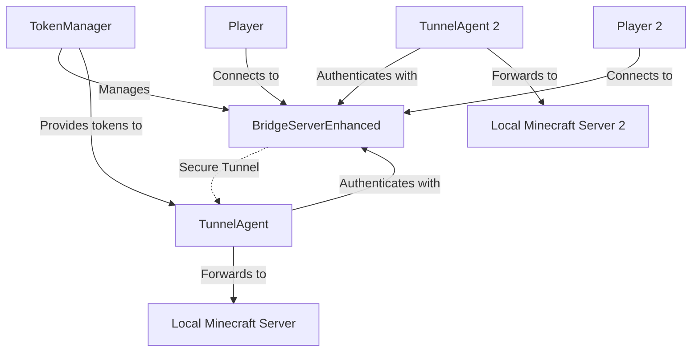
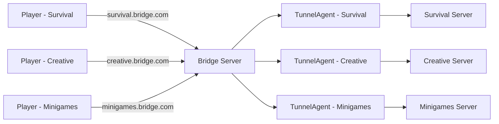

# Reverse Tunneling (VPS <-> Home)

Host Minecraft servers behind firewalls/NAT using a public VPS with enhanced security and multi-tenant support.

## Overview

The reverse tunnel feature allows you to run Minecraft servers at home or in private networks while making them accessible through a public VPS. The enhanced version includes token-based authentication, multi-tenant support, and advanced security features.

## Architecture

### Enhanced Reverse Tunnel with Authentication



### Multi-Tenant Architecture



## Setup Options

### Option 1: Using Executables (Recommended)

The easiest way to set up a reverse tunnel with enhanced security.

#### 1. On your VPS (Public Server)

**Step 1**: Create configuration file (`bridge-config.yaml`):
```yaml
bridge:
  port: 8080
  domain: bridge.yourdomain.com
  debug: true
  
  # Enable enhanced authentication
  auth:
    enabled: true
    secret: your-secure-auth-secret-here
    tokenExpiryHours: 24
    codeExpiryMinutes: 30
    maxTokensPerAgent: 3
```

**Step 2**: Run the enhanced bridge server:
```bash
./bridge-server-linux-x64 --config bridge-config.yaml
```

**Step 3**: Generate claim codes for your agents:
```bash
# The bridge server will display claim codes on startup
# Or use the API to generate them dynamically
```

#### 2. At Home (Private Servers)

**Step 1**: Get claim code from bridge server administrator
**Step 2**: Create agent configuration (`agent-config.yaml`):
```yaml
agent:
  bridgeHost: your-vps-ip.com
  bridgePort: 8080
  localHost: localhost
  localPort: 25565
  
  # Use the claim code provided by bridge admin
  # This will be exchanged for a token on first connection
  claimCode: ABCD12  # Replace with actual code
  
  # Agent identification
  agentId: survival-01
  namespace: survival
  
  # Connection settings
  reconnect:
    enabled: true
    interval: 5000
    maxAttempts: 10
```

**Step 3**: Run the enhanced tunnel agent:
```bash
./tunnel-agent-linux-x64 --config agent-config.yaml
```

### Option 2: Using as a Library

For integration into larger applications with custom logic.

#### Enhanced Bridge Server with Authentication

**`vps-bridge-enhanced.ts`**:
```typescript
import { BridgeServerEnhanced } from 'minecraft-tcp-proxy';

const bridge = new BridgeServerEnhanced({
  port: 8080,
  domain: 'bridge.yourdomain.com',
  debug: true,
  
  // Enhanced authentication
  auth: {
    enabled: true,
    secret: 'your-secure-auth-secret',
    tokenExpiryHours: 24,
    codeExpiryMinutes: 30,
    maxTokensPerAgent: 3
  }
});

// Generate claim codes for different servers
const survivalCode = bridge.generateClaimCode('survival-01', 'survival');
const creativeCode = bridge.generateClaimCode('creative-01', 'creative');

console.log('Survival server claim code:', survivalCode);
console.log('Creative server claim code:', creativeCode);

bridge.start();
```

#### Enhanced Tunnel Agent with Token Authentication

**`home-agent-enhanced.ts`**:
```typescript
import { TunnelAgent } from 'minecraft-tcp-proxy';

const agent = new TunnelAgent({
  bridgeHost: 'your-vps-ip.com',
  bridgeControlPort: 8080,
  localHost: 'localhost',
  localPort: 25565,
  
  // Use claim code for initial authentication
  claimCode: 'ABCD12', // Replace with actual code from bridge
  
  // Agent identification
  agentId: 'survival-01',
  namespace: 'survival',
  
  debug: true
});

// Handle authentication events
agent.on('authenticated', (token) => {
  console.log('Agent authenticated with token:', token);
});

agent.on('disconnected', () => {
  console.log('Agent disconnected, will attempt to reconnect...');
});

agent.start();
```

## Authentication Methods

### 1. Claim Code Authentication (Recommended for initial setup)

```typescript
// On bridge server - generate claim code
const claimCode = bridge.generateClaimCode('agent-01', 'survival');

// On agent - use claim code for authentication
const agent = new TunnelAgent({
  bridgeHost: 'vps.com',
  bridgePort: 8080,
  claimCode: 'ABCD12'  // One-time use code
});
```

### 2. Token Authentication (For automated deployments)

```typescript
// Generate token from claim code (one-time process)
const token = bridge.redeemClaimCode('ABCD12');

// Use token for subsequent connections
const agent = new TunnelAgent({
  bridgeHost: 'vps.com',
  bridgePort: 8080,
  authToken: token.token,
  agentId: 'agent-01',
  namespace: 'survival'
});
```

### 3. Legacy Shared Secret (Backward compatibility)

```typescript
// Bridge server
const bridge = new BridgeServerEnhanced({
  port: 8080,
  secret: 'shared-secret',  // Legacy authentication
  auth: { enabled: false }  // Disable enhanced auth
});

// Agent
const agent = new TunnelAgent({
  bridgeHost: 'vps.com',
  bridgePort: 8080,
  secret: 'shared-secret'  // Same shared secret
});
```

## Multi-Tenant Setup

### Scenario: Multiple Game Servers

**Bridge Server Configuration**:
```yaml
bridge:
  port: 8080
  domain: bridge.yourdomain.com  # Base domain
  
  auth:
    enabled: true
    secret: master-auth-secret
```

**Multiple Agents**:
```yaml
# Survival server agent
agent:
  bridgeHost: bridge.yourdomain.com
  bridgePort: 8080
  localPort: 25565
  agentId: survival-01
  namespace: survival

# Creative server agent
agent:
  bridgeHost: bridge.yourdomain.com
  bridgePort: 8080
  localPort: 25566
  agentId: creative-01
  namespace: creative

# Minigames server agent
agent:
  bridgeHost: bridge.yourdomain.com
  bridgePort: 8080
  localPort: 25567
  agentId: minigames-01
  namespace: minigames
```

**Player Connections**:
- Survival: `survival.bridge.yourdomain.com:8080`
- Creative: `creative.bridge.yourdomain.com:8080`
- Minigames: `minigames.bridge.yourdomain.com:8080`

## Security Features

### Token-Based Authentication
- **Secure tokens**: Cryptographically secure token generation
- **Expiration**: Configurable token lifetime
- **Revocation**: Ability to revoke compromised tokens
- **Rate limiting**: Protection against brute force attacks

### Connection Security
- **Rate limiting**: 20 connections per IP per second
- **Auth attempt limiting**: 5 attempts before 60-second lockout
- **IP-based blocking**: Automatic blocking of suspicious IPs
- **Timing-safe comparisons**: Protection against timing attacks

### Best Practices
1. **Use strong authentication secrets**
2. **Enable token authentication** for production
3. **Rotate tokens regularly**
4. **Monitor authentication logs**
5. **Use firewall rules** to restrict access
6. **Implement network segmentation**

## Monitoring and Management

### Token Statistics
```typescript
// Get authentication statistics
const stats = bridge.getTokenStats();
console.log('Active tokens:', stats.activeTokens);
console.log('Active claim codes:', stats.activeClaimCodes);
```

### Connection Monitoring
```typescript
bridge.on('agentConnected', (agentId, namespace) => {
  console.log(`Agent connected: ${agentId}.${namespace}`);
});

bridge.on('agentDisconnected', (agentId) => {
  console.log(`Agent disconnected: ${agentId}`);
});

bridge.on('playerConnected', (namespace, playerIp) => {
  console.log(`Player connected to ${namespace}: ${playerIp}`);
});
```

## Advanced Features

### Automatic Reconnection
- **Persistent connections**: Agents automatically reconnect on disconnect
- **Exponential backoff**: Smart reconnection timing
- **Health checks**: Regular connection health monitoring
- **Graceful degradation**: Continued operation during temporary outages

### Load Balancing (Future)
- **Multiple bridge instances**: Distribute load across servers
- **Health-based routing**: Route to healthy bridge instances
- **Geographic distribution**: Multi-region deployment support

## Troubleshooting

### Common Issues

1. **Authentication Failed**
   - Verify claim codes/tokens are correct
   - Check token expiration
   - Ensure auth secrets match

2. **Connection Refused**
   - Verify bridge server is running
   - Check firewall rules
   - Confirm port accessibility

3. **Subdomain Routing Not Working**
   - Verify domain configuration
   - Check DNS settings
   - Ensure subdomain matches namespace

### Debug Mode

Enable debug logging for detailed troubleshooting:
```bash
DEBUG=true ./bridge-server-linux-x64 --config config.yaml
# or
./tunnel-agent-linux-x64 --config config.yaml --debug
```

## How It Works

1. **Agent Registration**: Agent connects to bridge and authenticates
2. **Token Exchange**: Claim code exchanged for persistent token
3. **Control Channel**: Persistent control connection maintained
4. **Player Detection**: Bridge detects incoming player connections
5. **Dynamic Tunneling**: Temporary data channels created for each player
6. **Traffic Forwarding**: Bidirectional traffic forwarding between player and server
7. **Cleanup**: Automatic cleanup of disconnected sessions
