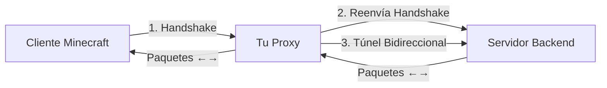

# Arquitectura Simplificada para Proxy Minecraft en Node.js/Bun

Basándome en el código de Gate, te puedo abstraer la arquitectura mínima necesaria para crear un proxy túnel simple para Minecraft que conecte a un único servidor backend.

## Arquitectura de Alto Nivel

Gate tiene dos modos de operación, y el que necesitas es el **Modo Lite**, que es exactamente lo que describes: un túnel TCP simple sin gestión de permisos. [1](#0-0) 

## Componentes Esenciales

Para implementar esto en Node.js/Bun, necesitas estos componentes básicos:

### 1. **Listener TCP** 
Acepta conexiones de clientes en el puerto 25565. [2](#0-1) 

### 2. **Parser del Handshake**
El primer paquete que envía el cliente contiene información vital: versión del protocolo, dirección del servidor y puerto. [3](#0-2) 

### 3. **Conexión al Backend**
Estableces una conexión TCP al servidor Minecraft backend. [4](#0-3) 

### 4. **Túnel Bidireccional**
Una vez establecidas ambas conexiones (cliente y backend), simplemente copias datos en ambas direcciones usando `io.Copy` o similar. [5](#0-4) 

## Flujo Simplificado



## Protocolo de Paquetes Minecraft

Cada paquete en Minecraft tiene esta estructura:

1. **Longitud del paquete** (VarInt) - cuántos bytes vienen después
2. **ID del paquete** (VarInt) - qué tipo de paquete es
3. **Datos del paquete** - contenido específico [6](#0-5) 

### Lectura de VarInt

El formato VarInt es crucial - es un entero de longitud variable usado extensivamente en el protocolo: [7](#0-6) 

## Implementación Simplificada en Node.js/Bun

Para tu caso de uso (un solo servidor, sin permisos), el código sería aproximadamente:

### Pasos Clave:

1. **Escuchar en puerto 25565**
2. **Leer el primer paquete (Handshake)**
   - Leer VarInt (longitud)
   - Leer VarInt (packet ID = 0x00)
   - Leer VarInt (protocol version)
   - Leer String (server address)
   - Leer UShort (port)
   - Leer VarInt (next state: 1=status, 2=login)

3. **Conectar al servidor backend**
4. **Reenviar el paquete Handshake al backend**
5. **Crear túnel bidireccional** usando streams:
   ```
   client.pipe(backend)
   backend.pipe(client)
   ```

## Manejo de Conexiones

Es importante gestionar correctamente el cierre de conexiones: [8](#0-7) 

## Consideraciones Importantes

### Buffer Management
Después de leer el handshake, puede haber datos en el buffer que necesitas reenviar: [9](#0-8) 

### Timeouts
Configura timeouts razonables para las conexiones: [10](#0-9) 

### Manejo del Estado de Conexión
El proxy debe mantener el estado de ambas conexiones y cerrar una si la otra se cierra: [11](#0-10) 

## Notes

**Ventajas del Modo Lite/Túnel Simple:**
- No necesitas decodificar cada paquete
- No necesitas mantener estado del juego
- Muy bajo overhead y alta performance
- Código mucho más simple

**Limitaciones:**
- No puedes interceptar comandos
- No puedes modificar datos del juego
- No puedes implementar permisos
- No hay autenticación del proxy (el servidor backend debe estar en modo online o manejar la autenticación)

**Para Node.js/Bun específicamente:**
- Usa `net.createServer()` para el listener TCP
- Usa `net.connect()` para conectar al backend
- Los streams de Node.js son perfectos para el túnel bidireccional
- En Bun, podrías usar `Bun.connect()` que es más eficiente

El código de Gate en modo Lite es esencialmente esto: lee el handshake, conecta al backend, y crea un túnel TCP. La complejidad adicional en Gate maneja casos edge como reconexiones, múltiples backends, balanceo de carga, etc., que no necesitas para un proxy simple de un solo servidor.

### Citations

**File:** pkg/edition/java/lite/forward.go (L37-79)
```go
// Forward forwards a client connection to a matching backend route.
func Forward(
	dialTimeout time.Duration,
	routes []config.Route,
	log logr.Logger,
	client netmc.MinecraftConn,
	handshake *packet.Handshake,
	pc *proto.PacketContext,
	strategyManager *StrategyManager,
) {
	defer func() { _ = client.Close() }()

	log, src, route, nextBackend, err := findRoute(routes, log, client, handshake, strategyManager)
	if err != nil {
		errs.V(log, err).Info("failed to find route", "error", err)
		return
	}

	// Find a backend to dial successfully.
	backendAddr, log, dst, err := tryBackends(nextBackend, func(log logr.Logger, backendAddr string) (logr.Logger, net.Conn, error) {
		conn, err := dialRoute(client.Context(), dialTimeout, src.RemoteAddr(), route, backendAddr, handshake, pc, false)
		return log, conn, err
	})
	if err != nil {
		return
	}
	defer func() { _ = dst.Close() }()

	if err = emptyReadBuff(client, dst); err != nil {
		errs.V(log, err).Info("failed to empty client buffer", "error", err)
		return
	}

	// Track connection for least-connections strategy
	var decrementConnection func()
	if route.Strategy == config.StrategyLeastConnections {
		decrementConnection = strategyManager.IncrementConnection(backendAddr)
		defer decrementConnection()
	}

	log.Info("forwarding connection", "backendAddr", backendAddr)
	pipe(log, src, dst)
}
```

**File:** pkg/edition/java/lite/forward.go (L102-117)
```go
func emptyReadBuff(src netmc.MinecraftConn, dst net.Conn) error {
	buf, ok := src.(interface{ ReadBuffered() ([]byte, error) })
	if ok {
		b, err := buf.ReadBuffered()
		if err != nil {
			return fmt.Errorf("failed to read buffered bytes: %w", err)
		}
		if len(b) != 0 {
			_, err = dst.Write(b)
			if err != nil {
				return fmt.Errorf("failed to write buffered bytes: %w", err)
			}
		}
	}
	return nil
}
```

**File:** pkg/edition/java/lite/forward.go (L119-135)
```go
func pipe(log logr.Logger, src, dst net.Conn) {
	// disable deadlines
	var zero time.Time
	_ = src.SetDeadline(zero)
	_ = dst.SetDeadline(zero)

	go func() {
		i, err := io.Copy(src, dst)
		if log.Enabled() {
			log.V(1).Info("done copying backend -> client", "bytes", i, "error", err)
		}
	}()
	i, err := io.Copy(dst, src)
	if log.Enabled() {
		log.V(1).Info("done copying client -> backend", "bytes", i, "error", err)
	}
}
```

**File:** pkg/edition/java/lite/forward.go (L219-287)
```go
func dialRoute(
	ctx context.Context,
	dialTimeout time.Duration,
	srcAddr net.Addr,
	route *config.Route,
	backendAddr string,
	handshake *packet.Handshake,
	handshakeCtx *proto.PacketContext,
	forceUpdatePacketContext bool,
) (dst net.Conn, err error) {
	dialCtx, cancel := context.WithTimeout(ctx, dialTimeout)
	defer cancel()

	var dialer net.Dialer
	dst, err = dialer.DialContext(dialCtx, "tcp", backendAddr)
	if err != nil {
		v := 0
		if dialCtx.Err() != nil {
			v++
		}
		// Treat connection refused as debug level to reduce spam
		// These are common when backends are down and should not flood logs
		if IsConnectionRefused(err) {
			v = 1
		}
		return nil, &errs.VerbosityError{
			Verbosity: v,
			Err:       fmt.Errorf("failed to connect to backend %s: %w", backendAddr, err),
		}
	}
	dstConn := dst
	defer func() {
		if err != nil {
			_ = dstConn.Close()
		}
	}()

	if route.ProxyProtocol {
		header := protoutil.ProxyHeader(srcAddr, dst.RemoteAddr())
		if _, err = header.WriteTo(dst); err != nil {
			return dst, fmt.Errorf("failed to write proxy protocol header to backend: %w", err)
		}
	}

	if route.ModifyVirtualHost {
		clearedHost := ClearVirtualHost(handshake.ServerAddress)
		backendHost := netutil.HostStr(backendAddr)
		if !strings.EqualFold(clearedHost, backendHost) {
			// Modify the handshake packet to use the backend host as virtual host.
			handshake.ServerAddress = strings.ReplaceAll(handshake.ServerAddress, clearedHost, backendHost)
			forceUpdatePacketContext = true
		}
	}
	if route.GetTCPShieldRealIP() && IsTCPShieldRealIP(handshake.ServerAddress) {
		// Modify the handshake packet to use TCPShieldRealIP of the client.
		handshake.ServerAddress = TCPShieldRealIP(handshake.ServerAddress, srcAddr)
		forceUpdatePacketContext = true
	}
	if forceUpdatePacketContext {
		update(handshakeCtx, handshake)
	}

	// Forward handshake packet as is.
	if err = writePacket(dst, handshakeCtx); err != nil {
		return dst, fmt.Errorf("failed to write handshake packet to backend: %w", err)
	}

	return dst, nil
}
```

**File:** pkg/edition/java/lite/forward.go (L289-299)
```go
func writePacket(dst net.Conn, pc *proto.PacketContext) error {
	err := util.WriteVarInt(dst, len(pc.Payload))
	if err != nil {
		return fmt.Errorf("failed to write packet length: %w", err)
	}
	_, err = dst.Write(pc.Payload)
	if err != nil {
		return fmt.Errorf("failed to write packet payload: %w", err)
	}
	return nil
}
```

**File:** pkg/edition/java/proxy/proxy.go (L543-582)
```go
// listenAndServe starts listening for connections on addr until closed channel receives.
func (p *Proxy) listenAndServe(ctx context.Context, addr string) error {
	if ctx.Err() != nil {
		return ctx.Err()
	}

	var lc net.ListenConfig
	ln, err := lc.Listen(ctx, "tcp", addr)
	if err != nil {
		return err
	}
	defer func() { _ = ln.Close() }()

	ctx, cancel := context.WithCancel(ctx)
	defer cancel()
	go func() { <-ctx.Done(); _ = ln.Close() }()

	p.event.Fire(&ReadyEvent{addr: addr})

	defer p.log.Info("stopped listening for new connections", "addr", addr)
	p.log.Info("listening for connections", "addr", addr)

	for {
		conn, err := ln.Accept()
		if err != nil {
			var opErr *net.OpError
			if errors.As(err, &opErr) && errs.IsConnClosedErr(opErr.Err) {
				// Listener was closed
				return nil
			}
			return fmt.Errorf("error accepting new connection: %w", err)
		}

		if p.cfg.ProxyProtocol {
			conn = proxyproto.NewConn(conn)
		}

		go p.HandleConn(conn)
	}
}
```

**File:** pkg/edition/java/proxy/proxy.go (L624-630)
```go
	// Create client connection
	conn, readLoop := netmc.NewMinecraftConn(
		ctx, raw, proto.ServerBound,
		time.Duration(p.cfg.ReadTimeout)*time.Millisecond,
		time.Duration(p.cfg.ConnectionTimeout)*time.Millisecond,
		p.cfg.Compression.Level,
	)
```

**File:** pkg/edition/java/proxy/session_client_handshake.go (L85-96)
```go
func (h *handshakeSessionHandler) handleHandshake(handshake *packet.Handshake, pc *proto.PacketContext) {
	// The client sends the next wanted state in the Handshake packet.
	nextState := stateForProtocol(handshake.NextStatus)
	if nextState == nil {
		h.log.V(1).Info("client provided invalid next status state, closing connection",
			"nextStatus", handshake.NextStatus)
		_ = h.conn.Close()
		return
	}

	// Update connection to requested state and protocol sent in the packet.
	h.conn.SetProtocol(proto.Protocol(handshake.ProtocolVersion))
```

**File:** pkg/edition/java/proto/util/reader.go (L1-50)
```go
package util

import (
	"bufio"
	"encoding/binary"
	"errors"
	"fmt"
	"io"
	"math"
	"strings"
	"time"

	"go.minekube.com/common/minecraft/key"
	"go.minekube.com/gate/pkg/edition/java/profile"
	"go.minekube.com/gate/pkg/util/uuid"
)

const (
	DefaultMaxStringSize = bufio.MaxScanTokenSize
)

func ReadString(rd io.Reader) (string, error) {
	return ReadStringMax(rd, DefaultMaxStringSize)
}

func ReadStringMax(rd io.Reader, max int) (string, error) {
	length, err := ReadVarInt(rd)
	if err != nil {
		return "", err
	}
	return readStringMax(rd, max, length)
}

func readStringMax(rd io.Reader, max, length int) (string, error) {
	if length < 0 {
		return "", errors.New("length of string must not 0")
	}
	if length > max*4 { // *4 since UTF8 character has up to 4 bytes
		return "", fmt.Errorf("bad string length (got %d, max. %d)", length, max)
	}
	str := make([]byte, length)
	_, err := io.ReadFull(rd, str)
	if err != nil {
		return "", err
	}
	return string(str), nil
}

func ReadStringArray(rd io.Reader) ([]string, error) {
	length, err := ReadVarInt(rd)
```

**File:** pkg/edition/java/netmc/connection.go (L211-284)
```go
func (c *minecraftConn) startReadLoop() {
	ctx, span := tracer.Start(c.ctx, "startReadLoop", trace.WithAttributes(
		attribute.String("net.peer.ip", c.RemoteAddr().String()),
		attribute.String("net.transport", c.c.RemoteAddr().Network()),
	))
	defer span.End()

	bytesRead := int64(0)
	defer func() { span.SetAttributes(attribute.Int64("net.bytes_read", bytesRead)) }()

	// Make sure to close connection on return, if not already closed
	defer func() { _ = c.closeKnown(false) }()

	debug := c.log.V(1)

	next := func() bool {
		// Wait until auto reading is enabled, if not already
		c.autoReading.Wait()

		// Read next packet from underlying connection.
		packetCtx, err := c.rd.ReadPacket()
		if err != nil {
			if errors.Is(err, ErrReadPacketRetry) {
				// Sleep briefly and try again
				time.Sleep(time.Millisecond * 5)
				return true
			}
			return false
		}
		bytesRead += int64(packetCtx.BytesRead)

		// TODO wrap packetCtx into struct with source info
		// (minecraftConn) and chain into packet interceptor to...
		//  - packet interception
		//  - statistics / count bytes
		//  - in turn call session handler

		sessionHandler := c.ActiveSessionHandler()

		if debug.Enabled() && packetCtx.KnownPacket() {
			_, span := tracer.Start(ctx, "HandlePacket", trace.WithAttributes(
				attribute.String("packet.type", fmt.Sprintf("%T", packetCtx.Packet)),
				attribute.String("packet.dump", fmt.Sprintf("%+v", spew.Sdump(packetCtx.Packet))),
				attribute.Stringer("packet.direction", c.direction),
				attribute.Stringer("conn.state", c.state),
				attribute.String("conn.sessionHandler", fmt.Sprintf("%T", sessionHandler)),
			))
			defer span.End()
		}

		// Handle packet by connection's session handler.
		sessionHandler.HandlePacket(packetCtx)
		return true
	}

	// Using two for loops to optimize for calling "defer, recover" less often
	// and be able to continue the loop in case of panic.

	cond := func() bool { return !Closed(c) && next() }
	loop := func() (ok bool) {
		defer func() { // Catch any panics
			if r := recover(); r != nil {
				c.log.Error(nil, "recovered panic in packets read loop", "panic", r)
				ok = true // recovered, keep going
			}
		}()
		for cond() {
		}
		return false
	}

	for loop() {
	}
}
```

**File:** pkg/edition/java/netmc/connection.go (L389-421)
```go
func (c *minecraftConn) Close() error {
	return c.closeKnown(true)
}

// ErrClosedConn indicates a connection is already closed.
var ErrClosedConn = errors.New("connection is closed")

func (c *minecraftConn) closeKnown(markKnown bool) (err error) {
	alreadyClosed := true
	c.closeOnce.Do(func() {
		defer c.SetAutoReading(true) // free the read loop in case auto reading is disabled

		alreadyClosed = false
		if markKnown {
			c.knownDisconnect.Store(true)
		}

		c.cancelCtx()
		err = c.c.Close()

		if sh := c.ActiveSessionHandler(); sh != nil {
			sh.Disconnected()

			if p, ok := sh.(interface{ PlayerLog() logr.Logger }); ok && !c.knownDisconnect.Load() {
				p.PlayerLog().Info("player has disconnected", "sessionHandler", fmt.Sprintf("%T", sh))
			}
		}
	})
	if alreadyClosed {
		err = ErrClosedConn
	}
	return err
}
```
